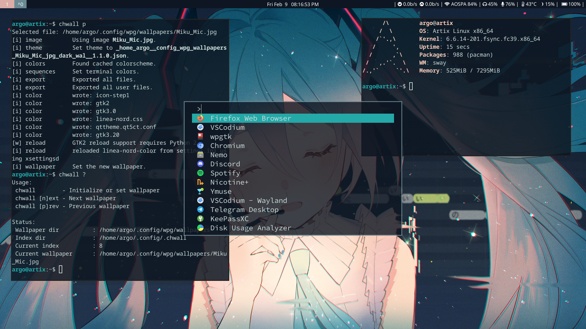
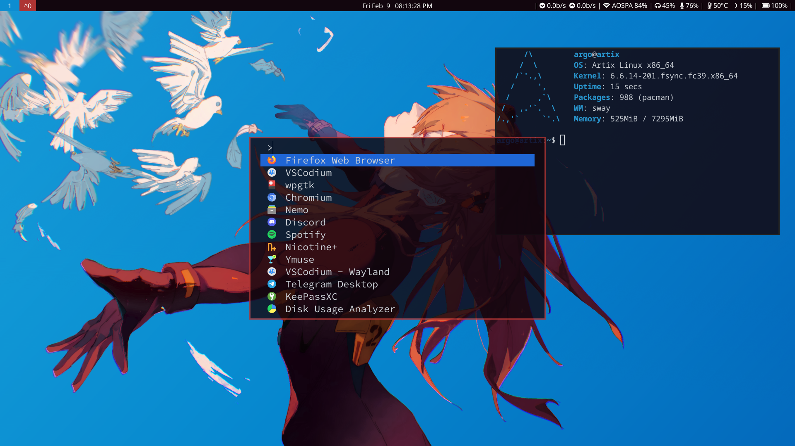

# artix-dinit-sway dotfiles (WIP)



<!--  -->

## Keybindings

| Keybinding        | Description                       |
| ----------------- | --------------------------------- |
| `MOD+ENTER`       | Terminal                          |
| `MOD+d`           | Fuzzel                            |
| `MOD+l`           | Swaylock                          |
| `MOD+Shift+e`     | Wlogout menu                      |
| `MOD+ARROWS`      | Move Focus                        |
| `PRT SC`          | Screenshot                        |
| `MOD+Shift+minus` | Move scratchpad                   |
| `MOD+minus`       | Show scratchpad                   |
| `MOD+r & ARROWS`  | Resize window                     |
| `MOD+Shift+Space` | Toggle floating                   |
| `MOD+[num]`       | Switch workspace number           |
| `MOD+Shift+[num]` | Move current workspace to target  |
| `MOD+LMB Drag`    | Drag and Move floating window     |
| `MOD+RMB Drag`    | Drag and Resize floating window   |
| `MOD+Shift+S`     | Toggle sticky for floating window |

### Change wallpaper & wpgtk theme

- Use [chwall](./.local/bin/chwall)

```shell
argo@artix:~$ chwall what
Usage:
 chwall        - Initialize or set wallpaper
 chwall [n]ext - Next wallpaper
 chwall [p]rev - Previous wallpaper

Status:
 Wallpaper dir		: /home/argo/.config/wpg/wallpapers
 Index dir		: /home/argo/.config/.chwall
 Current index		: 3
 Current wallpaper	: /home/argo/.config/wpg/wallpapers/Asuka_Blue.png
```

- Use linea-nord for gtk4 apps
  - border glitch? toggle floating
- qt5ct theme template - <https://gist.github.com/niksingh710/0a5c7ec302b3a88b5d7fdcb1aa952a2c>

### pkglist backup & restore

```bash
# Backup Arch and AUR pkglists
sudo pacman -Qqen > .pkglist
sudo pacman -Qqem > .pkglist-aur

# Restore both
sudo pacman -S --needed - < .pkglist
for x in $(< .pkglist-aur); do yay -S $x; done
```

### Install dinit-uservervd

- Refer - <https://github.com/Xynonners/dinit-userservd>
- do `makepkg -si`

### Setup snapshots using snapper and grub-btrfs

- Only for btrfs
- Refer - <https://www.lorenzobettini.it/2023/03/snapper-and-grub-btrfs-in-arch-linux/>
- Make sure to do `update-grub` to get Snapshot menu on grub
- Start btrfs-assistant by using `sudo -E btrfs-assistant-bin`

### Setup screen sharing

- Run [screensh](./.local/bin/screensh)
- Refer - <https://www.reddit.com/r/swaywm/comments/l4e55v/guide_how_to_screenshare_from_chromiumfirefox/>

## Todo

- [ ] Add greeter
- [ ] Add Notification management
- [ ] Make default gruvbox theme option
- [ ] Fix bugs