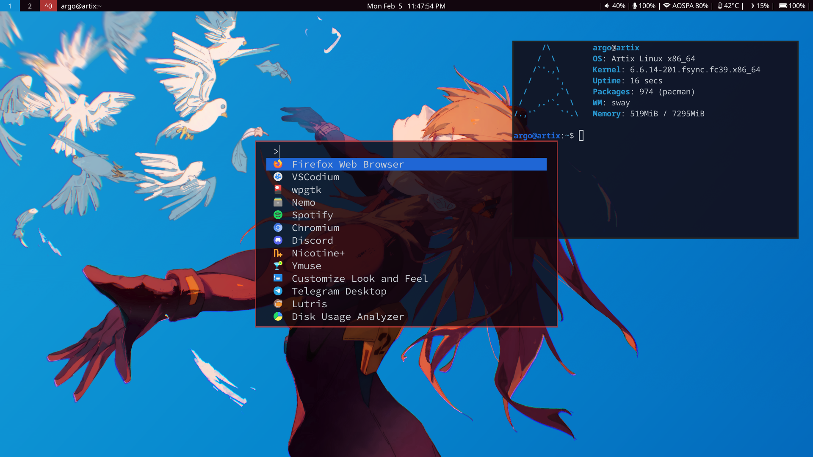

# artix-dinit-sway dotfiles (WIP)



## Keybindings

- `MOD+[num]` -> Switch Workspace number
- `MOD+ENTER` -> Terminal
- `MOD+ARROW` -> Move Focus
- `PRT SC` -> Screenshot
- `MOD+Shift+Space` -> Toggle floating
- `MOD+Shift+S` -> Toggle sticky for floating window
- `MOD+LMB Drag` -> Drag and Move floating window
- `MOD+RMB Drag` -> Drag and Resize floating window

## pkglist backup & restore

```bash
# Backup Arch and AUR pkglists
sudo pacman -Qqen > .pkglist
sudo pacman -Qqem > .pkglist-aur

# Restore both
sudo pacman -S --needed - < .pkglist
for x in $(< .pkglist-aur); do yay -S $x; done
```

## install dinit-uservervd

- Refer - https://github.com/Xynonners/dinit-userservd
- do `makepkg -si`

## Setup snapshots using snapper and grub-btrfs

- Only for btrfs
- Follow - https://www.lorenzobettini.it/2023/03/snapper-and-grub-btrfs-in-arch-linux/
- Make sure to do `update-grub` to get Snapshot menu on grub
- Start btrfs-assistant by using `sudo -E btrfs-assistant-bin`

## Setup screen sharing

- Run [screensh](./.local/bin/screensh)
- Refer - https://www.reddit.com/r/swaywm/comments/l4e55v/guide_how_to_screenshare_from_chromiumfirefox/
- Todo make dinit user service

## wpgtk

- use linea-nord for gtk4 apps
  - border glitch? toggle floating
- qt5ct theme template - https://gist.github.com/niksingh710/0a5c7ec302b3a88b5d7fdcb1aa952a2c
